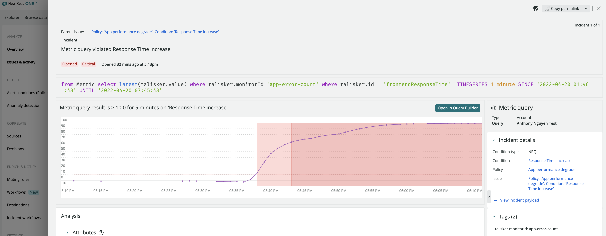

# Create New Relic Alert based on permformance degradation (COMPARE WITH Query)

## Setup Scripted API Monitor
-   Create 2 new API keys: an INGEST-LICENSE and USER
-   Go to `New Relic > Synthetics > Secure credentials` and `Create secure credential`. Create 2 secure credentials, you will need these for later steps
    -   YOUR_SECURE_CRED_CONTAINING_INSERT_KEY: your INGEST-LICENSE key
    -   YOUR_SECURE_CRED_CONTAINING_QUERY_KEY: your USER key
-   Go to `New Relic > Synthetics > Create Monitor`. Select `Endpoint avaiability`
-   Provide name and select frequency (e.g. 1 hour -> 1 day)
-   Select locations (e.g. Sydney), click `Write Script`
-   Enter the content of the `modules\Talisker\base_script.js` file
-   Modify the following:
    -   AccountId: your Account ID
    -   TASKS[0].id: you can keep it as `frontendResponseTime` or change it to anything you want (you will need this later)
    -   TASKS[0].name: you can name it anything you want
    -   TASKS[0].query: this is the NRQL which is used to query the application performance and compare it with previous period => modify it as required
-   click on `Validate` => make sure it is successful
-   if successful , click on `Save monitor`

## Create Alerts
- Click on `Query your data` and run this query: `from Metric select latest(talisker.value) where talisker.monitorId='app-error-count' where talisker.id = 'frontendResponseTime'`
- It should return % Difference (`((current - previous) / current) * 100`) from your NRQL above. So if the value is > 0, this means response time in the last 1 hour is slower than 1 day ago. If it is < 0, it is faster
- Click on `Create Alert` and configure the threshold accordingly, e.g. `raise critical violation if the value is > 10% for at least 5 minutes`

- Example incidents:

